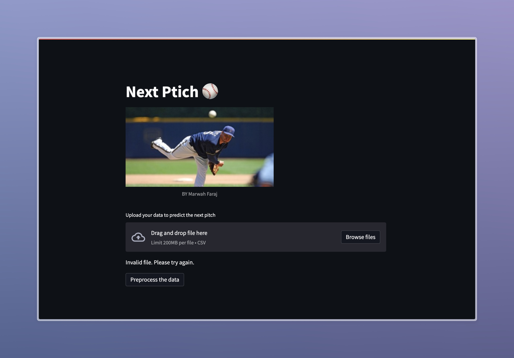

# Next Pitch Prediction 

This repository implements a Streamlit application for predicting the next pitch type in baseball games based on historical data. It allows users to upload a CSV file containing game data and receive a predicted pitch type alongside the actual pitch for comparison.

## Features

* ### Data Preprocessing
    * Segments game time based on daily time periods.
    * Selects relevant features for prediction.
    * Handles missing values.
    * Balances class distribution using SMOTE to address potential bias.
    * Applies RobustScaler for data normalization.
* ### Model Prediction
    * Leverages a trained Extra Trees Classifier model for accurate pitch type prediction.
    * Utilizes joblib for efficient model loading and prediction.
* ### User Interface
    * Provides a user-friendly interface built with Streamlit.
    * Accepts CSV data uploads for seamless prediction.
    * Displays informative messages throughout the process, including data preprocessing status and prediction results.

## Project Structure

```
/data               # Contains data source such as CSV
/images             # Contains static assets like images
/notebooks          # Optional directory for data exploration or analysis notebooks
/extras             # Optional directory for additional files
app.py              # Main Python script for the Streamlit app
requirements.txt    # File listing project dependencies
setup.sh            # Optional script for initial setup
run.sh              # Optional script to launch the app
```

## Dependencies

* Streamlit
* scikit-learn
* imblearn
* pandas
* numpy
* joblib
* Pillow

## Getting Started

1. **Install dependencies:** Ensure you have Python and pip installed. Then, run `pip install -r requirements.txt` to install the required libraries.
2. **Prepare data:** Ensure your CSV file contains relevant features for pitch prediction, such as inning, pitch count, and batter/pitcher information.
3. **Run the app:** Execute `sh run.sh` (or your preferred startup method) to launch the Streamlit application.
4. **Upload data:** Click the "Upload your data to predict the next pitch" button and select your CSV file.
5. **Preprocess and predict:** Click the "Preprocess the data" button to initiate data processing and prediction. The app will display informative messages and the predicted pitch type compared to the actual pitch.

## Demo




## Contributing

> We welcome contributions to this project! Feel free to fork the repository, make improvements, and submit pull requests.